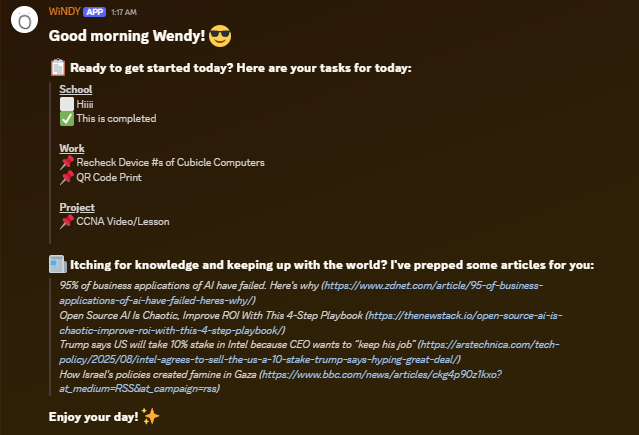

# WiNDY Discord Bot

WiNDY is an intelligent Discord bot designed to automate daily briefings, task management, and news curation using Notion and machine learning. Built for productivity and information delivery, WiNDY integrates with Notion dashboards and leverages RSS feeds and ML-powered article selection to keep you informed and organized.

## Features

- **Automated Daily Briefings:** Sends a summary of tasks and curated news articles every morning.
- **Notion Integration:** Fetches and manages tasks from multiple Notion dashboards.
- **Machine Learning Article Selection:** Uses a custom-trained model to pick the most interesting news articles from various sources.
- **Manual Commands:** Trigger briefings or clean up completed tasks on demand.
- **Scheduled Cleanups:** Automatically clears completed tasks from Notion at the end of each day.

## Tech Stack

- Python 3.11
- discord.py
- Notion API
- scikit-learn (ML)
- feedparser
- APScheduler
- Docker

## Setup Instructions

1. **Clone the repository:**
	```sh
	git clone https://github.com/Programming-Mellow/WiNDY.git
	cd WiNDY
	```

2. **Install dependencies:**
	```sh
	pip install -r requirements.txt
	```

3. **Set up environment variables:**
	- Copy `.env.example` to `.env` and fill in your Discord and Notion tokens and dashboard IDs.

4. **Adjust the following files:**
	- Your circumstances will differ in your life compared to mine.
	- As a result, it is recommended to change the following files to make the program work around your needs:
		- run.py
		- articles.csv (training data)
		- data/api_hander.py
		- data/preprocessing.py
		- data/rss_handler.y
		- bot/main.py

5. **Train the ML model:**
	- Place your labeled article data in `ml/articles.csv` (see format in the file).
	- Run:
	  ```sh
	  python ml/train.py
	  ```

6. **Run the bot:**
	```sh
	python bot/main.py
	```

## Usage

- The bot will automatically send a daily briefing and perform nightly cleanup.
- Use `!briefing` in your Discord server to trigger a manual briefing.
- Use `!cleanup` to manually clear completed tasks.

## Example


